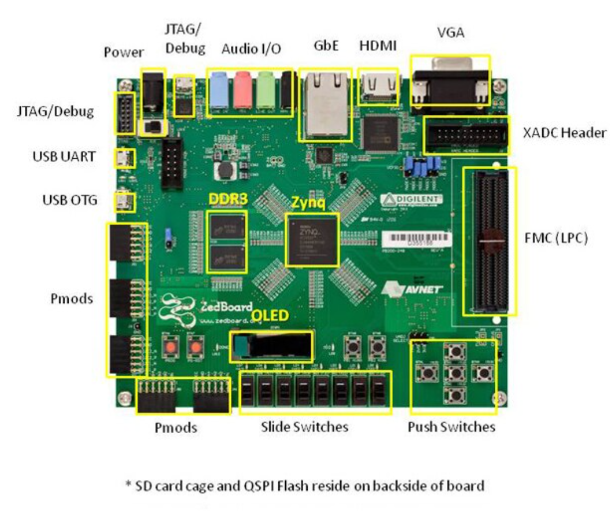

# ZedBoard — Zynq-7000 Evaluation and Development Board



The **ZedBoard** is an evaluation and development board built around the **Xilinx Zynq-7000 XC7Z020 SoC (System on Chip)**. It was designed by Digilent and distributed by Avnet, and it remains one of the most popular FPGA learning platforms in universities and research labs worldwide.

---

## What Makes the ZedBoard Special?

The ZedBoard is not just an FPGA board. It is a **Zynq EPP (Extensible Processing Platform)** — meaning it combines two completely different computing paradigms on a single chip:

### The Zynq-7000 Architecture

```
┌─────────────────────────────────────────┐
│           Zynq XC7Z020 SoC              │
│                                         │
│  ┌──────────────────┐  ┌─────────────┐  │
│  │  PS (Processing  │  │  PL (Prog.  │  │
│  │     System)      │  │   Logic)    │  │
│  │                  │  │             │  │
│  │  Dual ARM        │  │  85,000     │  │
│  │  Cortex-A9       │  │  Series-7   │  │
│  │  @ up to 667MHz  │  │  FPGA Cells │  │
│  │                  │  │             │  │
│  │  512MB DDR3 RAM  │  │  Custom     │  │
│  │  L1/L2 Cache     │  │  Hardware   │  │
│  │  FPU             │  │  Logic      │  │
│  └────────┬─────────┘  └──────┬──────┘  │
│           │    AXI Bus        │         │
│           └───────────────────┘         │
└─────────────────────────────────────────┘
```

The PS (ARM side) runs your C/C++ software. The PL (FPGA side) implements custom hardware. They talk to each other through a high-speed AXI interconnect bus. This combination is the key advantage of the Zynq platform.

---

## Key Hardware Specifications

| Component | Details |
|---|---|
| SoC | Xilinx Zynq XC7Z020-1CSG484 |
| CPU | Dual-core ARM Cortex-A9 (up to 667 MHz) |
| FPGA Logic | 85,000 Series-7 Programmable Logic Cells |
| RAM | 512 MB DDR3 (128M x 32-bit, up to 533 MHz) |
| Flash | 256 Mb QSPI (Spansion S25FL256S) |
| PS Clock | 33.333 MHz |
| PL Clock | 100 MHz |
| Board Size | 6.3" x 6.3" |
| Power Input | 12V barrel jack (2.5mm ID, 5.5mm OD) |

---

## On-Board Peripherals

### Display
- **128x32 OLED Display** (Inteltronic UG-2832HSWEG04) — 5 signal pins connected to PL Bank 0
- **HDMI Output** — Analog Devices ADV7511 transmitter, supports 1080p60
- **VGA Output** — 12-bit color through resistor ladder on PL pins

### Communication
- **USB-to-UART Bridge** — Cypress CY7C64225, appears as COM port on PC at 115200 baud
- **USB-JTAG** — Digilent SMT1 module for programming via Micro-B USB
- **USB OTG 2.0** — TI TUSB1210 PHY, supports Host/Device/OTG modes
- **10/100/1000 Ethernet** — Marvell 88E1518 PHY via RGMII

### Storage
- **SD Card slot** — 4GB Class 4 included, can boot Zynq from SD
- **256 Mb QSPI Flash** — For non-volatile bitstream and code storage

### Audio
- **I2S Audio Codec** — Analog Devices ADAU1761, stereo 8-96 KHz
- Line In, Line Out, Headphone Out, Microphone In (3.5mm jacks)

### User I/O
- **8 User LEDs** (PL) + 1 PS LED
- **8 DIP Slide Switches** (PL)
- **5 Push Buttons** (PL) + 2 PS Push Buttons
- **DONE LED** (blue, lights when PL bitstream is loaded)
- **Power Good LED** (green)

### Expansion
- **5 Pmod headers** (2x6, Digilent compatible) — 4 on PL, 1 on PS MIO
- **1 LPC FMC connector** — 68 single-ended I/O (34 differential pairs)
- **1 XADC/AMS header** — Analog input channels for ADC
- **XADC** — Internal Zynq ADC with VP/VN and auxiliary channels

---

## OLED Pin Mapping (from User Guide)

The on-board OLED connects directly to Zynq PL Bank 0 pins:

| OLED Signal | Zynq EPP Pin | Function |
|---|---|---|
| VDD | U12 | Logic power supply |
| VBAT | U11 | DC/DC converter power |
| RES# | U9 | Reset |
| D/C# | U10 | Data/Command select |
| SCLK | AB12 | SPI Clock |
| SDIN | AA12 | SPI Data |

These are the exact pins used in the `zenboard_oled` bit-bang project via AXI GPIO.

---

## Pmod Port Reference

The ZedBoard has 5 Pmod ports. 4 connect to PL Bank 13 (3.3V), 1 connects to PS MIO:

| Port | Type | Zynq Pins |
|---|---|---|
| JA | PL | Y11, AA11, Y19, AA9, AB11, AB10, AB9, AA8 |
| JB | PL | W12, W11, V10, W8, V12, W10, V9, V8 |
| JC | PL Differential | AB6/7, AA4/Y4, T6/R6, U4/T4 |
| JD | PL Differential | W7/V7, V4/V5, W5/W6, U5/U6 |
| JE | PS MIO | A6, G7, B4, C5, G6, C4, B6, E6 |

---

## Why the ZedBoard is Excellent for Learning

### 1. PS + PL Architecture teaches real SoC design
Most development boards are either a pure microcontroller OR a pure FPGA. The ZedBoard gives you both on the same chip connected by a real AXI bus. This mirrors how professional SoC designs work in industry (automotive, aerospace, telecom).

### 2. Two ways to solve every problem
For any peripheral task, you can choose to implement it in PS software or PL hardware. Comparing both approaches on the same board (as done in the two OLED projects in this folder) gives a clear understanding of the tradeoffs between software flexibility and hardware performance.

### 3. Real ARM processor — not a soft core
The Cortex-A9 is a hard processor baked into silicon, not a soft-core CPU synthesized from LUTs. It runs at full speed with dedicated caches, FPU, and memory controller. You can run bare-metal C, FreeRTOS, or even Linux on it.

### 4. Industry-standard tools
Vivado and Vitis are the same tools used in professional FPGA development at companies like Qualcomm, Intel, AMD, and aerospace firms. Learning on the ZedBoard gives you direct experience with production-grade toolchains.

### 5. Rich peripheral ecosystem
The combination of HDMI, VGA, Ethernet, USB, audio, OLED, SD card, and Pmod expansion means you can build complex, complete systems without needing external hardware for most projects.

### 6. AXI Bus — the industry standard interconnect
Every peripheral you add in Vivado connects via the AXI4 protocol. AXI is used in virtually every ARM-based SoC in production today (phones, embedded systems, automotive ECUs). Understanding AXI on the ZedBoard translates directly to professional embedded system design.

---

## PS vs PL — When to Use Each

| Use PS (ARM Software) | Use PL (FPGA Hardware) |
|---|---|
| General application logic | Real-time signal processing |
| UART / USB communication | Custom high-speed protocols |
| User interface and menus | Parallel computation |
| File system access (SD) | Hardware acceleration |
| Simple GPIO toggling | Precise timing control |
| Prototyping and debugging | DSP, image processing |
| Running an OS (Linux) | Custom peripherals (SPI, I2C, PWM) |

The key insight: **PS is flexible but sequential. PL is rigid but massively parallel.**

---

## Boot Modes

The ZedBoard supports multiple boot sources selected by jumpers JP7-JP11:

| Mode | Jumper Setting | Use Case |
|---|---|---|
| JTAG | MIO[5:3] = 000 | Debug and development via USB |
| Quad-SPI | MIO[5:3] = 100 | Boot from onboard flash |
| SD Card | MIO[5:3] = 110 | Boot from SD card (default) |

For Vivado/Vitis development, **JTAG mode** is used — the tools program the device directly over USB without needing a bootloader.

---

## Bank Voltage Reference

| Bank | Side | Voltage | Connected To |
|---|---|---|---|
| MIO Bank 0/500 | PS | 3.3V | QSPI, OLED, JTAG Pmod |
| MIO Bank 1/501 | PS | 1.8V | Ethernet, USB, UART, SD |
| DDR | PS | 1.5V | DDR3 memory |
| Bank 0 | PL | 3.3V | JTAG, LEDs, OLED |
| Bank 13 | PL | 3.3V | Pmod JA, JB, JC, JD |
| Bank 33 | PL | 3.3V | HDMI, LEDs, VGA |
| Bank 34/35 | PL | Vadj (2.5V default) | FMC, Push Buttons, Switches |

---

## Projects in This Folder

| Folder | Description |
|---|---|
| `zenboard_oled/` | OLED display using pure PS software bit-banging via AXI GPIO |
| `zenboarrd_oled_throughipblock/` | OLED display using dedicated Digilent PmodOLED AXI IP in PL |

Both projects drive the same SSD1306 OLED display and accept typed text from a UART serial terminal, but implement the SPI communication in completely different ways. Reading both projects together gives a full picture of PS vs PL design tradeoffs on the Zynq platform.

---

## Reference Documents

- ZedBoard Hardware User's Guide v1.1 (included: `zedboard_ug.pdf`)
- Xilinx Zynq-7000 Technical Reference Manual (UG585)
- Digilent ZedBoard Resource Center: https://digilent.com/reference/programmable-logic/zedboard/start

---

## Board Details

**Manufacturer:** Digilent / Avnet  
**Chip:** Xilinx Zynq XC7Z020-1CSG484CES  
**User Guide Version:** 1.1, August 2012  
**Board Dimensions:** 6.3" x 6.3"  
**Power:** 12V @ 5A AC/DC supply (barrel jack)
