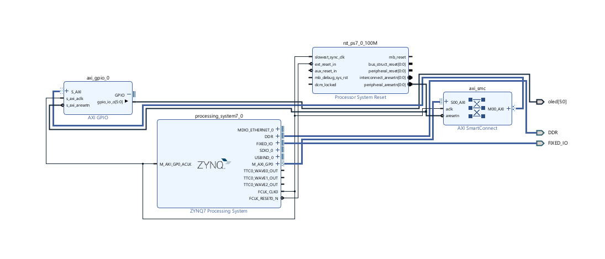
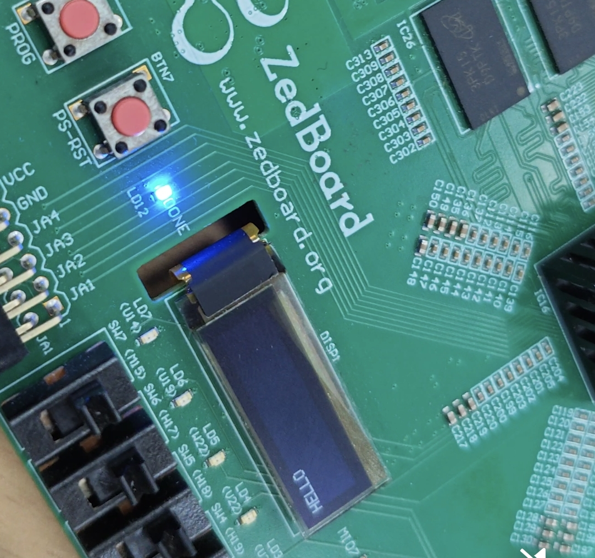
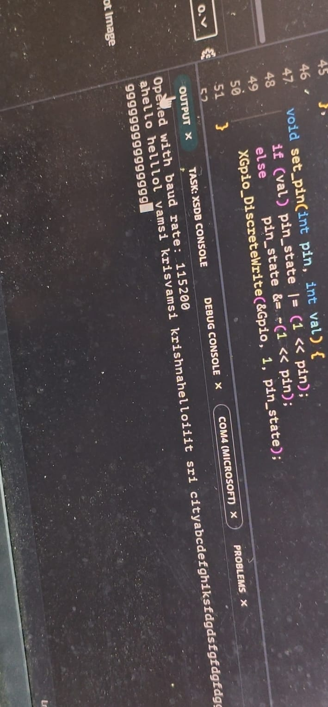

# ZedBoard PmodOLED Display via Pure PS Software (Bit-Banging)

A bare-metal embedded project running on the **ZedBoard (Zynq-7000 SoC)** that drives a **PmodOLED** display (SSD1306) using **pure software bit-banging** on the ARM Cortex-A9 Processing System (PS). No dedicated SPI IP is used — every signal is manually toggled by the CPU through an AXI GPIO peripheral.





---

## What Does This Project Do?

- Initializes the SSD1306 OLED display entirely in C using manual SPI bit-banging
- Listens for characters typed in your PC serial terminal via UART
- Renders each typed character live on the physical OLED screen using a custom 5x7 bitmap font table
- Automatically wraps text to the next line when the current line is full
- Pressing **Enter** clears the screen and resets the cursor to the top-left

---

## How It Works — The Bit-Bang SPI Approach

This project does **not** use any dedicated SPI hardware controller in the FPGA fabric. Instead, the ARM CPU manually controls 6 GPIO output pins connected to the OLED:

| Pin Name | GPIO Bit | Purpose |
|---|---|---|
| DC | 0 | Data/Command select |
| RES | 1 | Hardware Reset |
| SCLK | 2 | SPI Clock (manually toggled) |
| SDIN | 3 | SPI Data In (MOSI) |
| VBAT | 4 | VBAT power control |
| VDD | 5 | VDD power control |

For every single byte sent to the OLED, the CPU executes this loop 8 times:
1. Pull SCLK LOW
2. Put the next data bit on SDIN
3. Pull SCLK HIGH
4. Repeat for all 8 bits

This is called **bit-banging** — the CPU is manually pretending to be a hardware SPI controller using plain GPIO writes.

### The Custom Font System
Since no library is used, the project includes a hand-coded **5x7 pixel bitmap font table** (`FontLookup[128][5]`) directly in main.c. Each character is stored as 5 bytes, where each byte represents one column of 7 pixels. For example, the letter `A` is stored as:
```c
['A'] = {0x7E, 0x11, 0x11, 0x11, 0x7E}
```
When printed, 5 data bytes are sent to the OLED followed by one blank byte (0x00) as a gap between characters, giving 6 pixels per character and allowing up to ~21 characters per 128-pixel wide row.

---

## Block Design Overview

The Vivado block design is intentionally minimal for this project:

```
ZYNQ7 Processing System
        |
        | M_AXI_GP0 (AXI Master)
        |
   AXI SmartConnect
        |
   AXI GPIO (axi_gpio_0)
        |
   oled[5:0]  ──► Physical Pmod pins (DC, RES, SCLK, SDIN, VBAT, VDD)
```

- The **ZYNQ PS** runs the C application on the ARM Cortex-A9
- The **AXI GPIO** block exposes 6 output pins mapped to a memory address
- The CPU writes to that memory address to toggle any pin high or low
- No SPI controller, no DMA, no interrupts — just plain GPIO writes

---

## Why Is This Approach Different from the IP Block Project?

See the companion project [`zenboarrd_oled_throughipblock`](../zenboarrd_oled_throughipblock) for the hardware IP approach. Here is a direct comparison:

| Feature | This Project (Bit-Bang) | IP Block Project |
|---|---|---|
| SPI Controller | CPU manually toggles pins | Dedicated AXI SPI hardware |
| CPU load during transfer | 100% busy | Nearly 0% |
| SPI speed | Slow (CPU loop limited) | Fast (hardware clock) |
| Font/driver library | Custom hand-coded in main.c | Digilent PmodOLED library |
| Block design complexity | Very simple (just GPIO) | More complex (GPIO + SPI IP) |
| Code complexity | Higher (manual bit-bang) | Lower (library calls) |
| Learning value | Teaches SPI from scratch | Teaches IP integration |

**This project is the better one for learning** because you can see exactly how SPI communication works at the signal level. Every clock pulse is visible in the code.

---

## Tools and Hardware Required

| Item | Details |
|---|---|
| FPGA Board | ZedBoard (Xilinx Zynq-7000 XC7Z020) |
| Display | PmodOLED (SSD1306, 128x32 pixels) |
| Vivado Version | 2025.2 |
| Vitis Version | 2025.2 (Unified IDE) |
| Host OS | Windows 10/11 |

---

## Project Structure

```
zenboard_oled/
├── zenboard_oled.xpr           # Vivado project file (open this first)
├── oled_system_wrapper.xsa     # Hardware handoff file for Vitis
├── .gitignore
├── block_diagram.png           # Vivado block design screenshot
├── fpga_output.jpeg            # Photo of working OLED output
├── serial_monitor.jpeg         # Photo of serial monitor output
├── zenboard_oled.srcs/         # Vivado source files and block design
├── oled_app_component/
│   └── src/
│       ├── main.c              # Entire application — bit-bang SPI + font + UART
│       ├── lscript.ld          # Linker script
│       └── CMakeLists.txt      # CMake build configuration
└── oled_platform/              # Vitis platform component
```

---

## How to Replicate This Project

### Step 1: Clone the Repository
```
git clone <your-repo-url>
cd zenboard_oled
```

### Step 2: Open the Vivado Project
1. Open **Vivado 2025.2**
2. Click **Open Project** and select `zenboard_oled.xpr`
3. The block design loads with ZYNQ PS + AXI GPIO connected

### Step 3: Generate Bitstream
1. Click **Generate Bitstream** in the Flow Navigator
2. Wait for synthesis and implementation to complete
3. Go to **File → Export → Export Hardware** (include bitstream)
4. Save as `oled_system_wrapper.xsa` (already included in repo)

### Step 4: Open in Vitis Unified IDE
1. Open **Vitis Unified IDE 2025.2**
2. Set workspace to the cloned project folder
3. You should see `oled_platform` and `oled_app_component` in the Explorer

### Step 5: Build the Platform FIRST
1. In the **FLOW panel** (bottom left), select **oled_platform** from the dropdown
2. Click **Build** and wait for it to complete
3. This generates `ps7_init.tcl` and all BSP files — do not skip this

### Step 6: Build the Application
1. Switch the FLOW panel dropdown to **oled_app_component**
2. Click **Build**
3. Clean compile — no external libraries needed, everything is in main.c

### Step 7: Verify the Run Configuration
1. Open `oled_app_component/_ide/launch.json`
2. Make sure **Initialization file** points to:
   ```
   ${workspaceFolder}\oled_platform\export\oled_platform\sw\standalone_ps7_cortexa9_0\ps7_init.tcl
   ```
3. Verify these are checked: **Run ps7_init**, **Run Ps7 Post Init**, **Reset Entire System**, **Program Device**

### Step 8: Connect Hardware and Run
1. Connect the PmodOLED to the **JA Pmod port** on the ZedBoard
   - Match pins: DC→JA1, RES→JA2, SCLK→JA3, SDIN→JA4, VBAT→JA7, VDD→JA8 (verify against your XDC constraints)
2. Connect USB to the ZedBoard UART/PROG port
3. Open **Serial Terminal** in Vitis (Window → Show View → Serial Terminal)
4. Connect at **115200 baud, 8N1**
5. Power ON the ZedBoard
6. Click **Run** in the FLOW panel

### Step 9: Type and Display
Once running, simply type characters in the serial terminal. Each character appears instantly on the OLED screen. Press **Enter** to clear the screen and start fresh.

---

## Understanding the SSD1306 Initialization Sequence

The `oled_init()` function sends a specific sequence of commands to the SSD1306 controller chip. Here is what each command does:

| Command | Hex | Purpose |
|---|---|---|
| Display OFF | 0xAE | Turn display off before init |
| Clock Divide | 0xD5, 0x80 | Set display clock divide ratio |
| Multiplex | 0xA8, 0x1F | Set mux ratio for 32 row display |
| Display Offset | 0xD3, 0x00 | No vertical offset |
| Start Line | 0x40 | RAM start line = 0 |
| Charge Pump | 0x8D, 0x14 | Enable internal charge pump |
| Memory Mode | 0x20, 0x02 | Page addressing mode |
| Segment Remap | 0xA1 | Mirror horizontally |
| COM Scan | 0xC8 | Scan from COM[N] to COM[0] |
| COM Pins | 0xDA, 0x02 | Sequential COM pin config |
| Contrast | 0x81, 0x8F | Set brightness level |
| Pre-charge | 0xD9, 0xF1 | Pre-charge period |
| VCOMH Deselect | 0xDB, 0x40 | VCOMH deselect level |
| Display ON | 0xAF | Turn display on |

---


