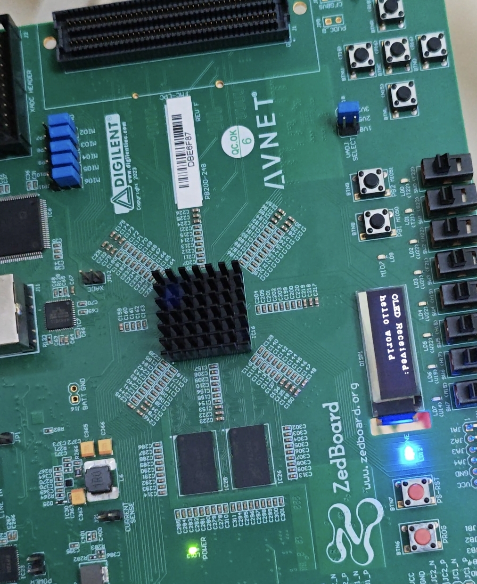
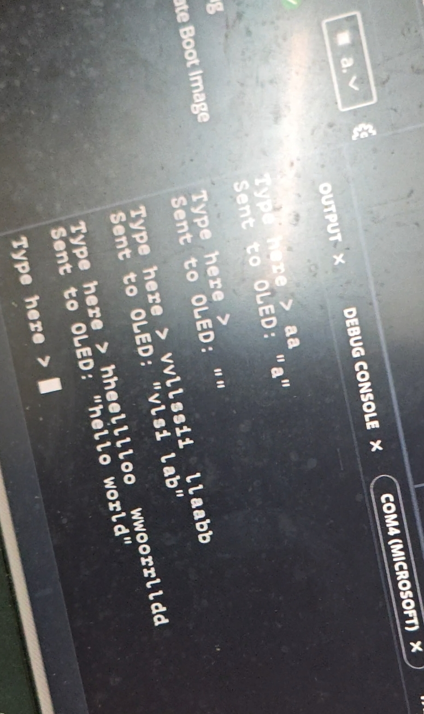

# ZedBoard PmodOLED Display via Dedicated IP Block

A bare-metal embedded project running on the **ZedBoard (Zynq-7000 SoC)** that drives a **Digilent PmodOLED** display using a dedicated AXI-based IP block in the Programmable Logic (PL), controlled by software running on the ARM Cortex-A9 Processing System (PS).





---

## What Does This Project Do?

- Initializes the PmodOLED display through the Digilent PmodOLED IP peripheral
- Accepts text input typed from your PC via UART serial terminal
- Displays the typed text live on the physical OLED screen
- Simultaneously echoes output back to the serial monitor on your PC
- Supports backspace for typo correction in the terminal

---

## Why Use a Dedicated PL IP Block Instead of Pure PS Software?

This is the most important design decision in this project, and it is worth understanding clearly.

### The Pure Software (PS-only) Approach
In the companion project (`zenboard_oled`), the OLED is driven entirely in C code running on the ARM processor. Every SPI clock pulse, every data bit, and every GPIO toggle is manually bit-banged by the CPU in a software loop. This works, but it means:

- The ARM CPU is **fully occupied** toggling pins during every display update
- Timing is controlled by software delay loops (`usleep`), which are imprecise
- The CPU cannot do anything else while it is driving the display
- SPI communication speed is limited by how fast the CPU can execute the bit-bang loop

### The Dedicated IP (PL) Approach (This Project)
Here, a **dedicated AXI SPI + GPIO IP block** is instantiated in the Zynq FPGA fabric (PL side). This hardware peripheral handles all the low-level SPI signaling autonomously. The ARM CPU only needs to:

- Write a byte to a memory-mapped register
- The hardware IP takes over and clocks it out at full SPI speed automatically

**Concrete advantages:**

| Feature | PS Software Only | PL IP Block |
|---|---|---|
| SPI Speed | Limited by CPU loop speed | Full hardware SPI clock rate |
| CPU Usage During Transfer | 100% occupied | Nearly 0% (CPU is free) |
| Timing Accuracy | Software delay loops | Hardware clock-precise |
| Scalability | Hard to add more peripherals | Add more IPs in parallel |
| Real-time capability | Poor | Excellent |

This is exactly why industrial embedded systems always offload peripheral communication (SPI, I2C, UART) to dedicated hardware controllers rather than bit-banging in software.

---

## Tools and Hardware Required

| Item | Details |
|---|---|
| FPGA Board | ZedBoard (Xilinx Zynq-7000 XC7Z020) |
| Display | Digilent PmodOLED (SSD1306, 128x32 pixels) |
| Vivado Version | 2025.2 |
| Vitis Version | 2025.2 (Unified IDE) |
| Digilent IP Library | vivado-library-master (included in repo) |
| Host OS | Windows 10/11 |

---

## Project Structure

```
zenboarrd_oled_throughipblock/
├── zenboarrd_oled_throughipblock.xpr   # Vivado project file (open this first)
├── oled_block_design_ip_wrapper.xsa    # Hardware handoff file for Vitis
├── .gitignore
├── block diagram.png                   # Vivado block design screenshot
├── fpga_oled_display.jpeg              # Photo of working OLED output
├── serial_monitor.jpeg                 # Photo of serial monitor output
├── vivado-library-master/              # Digilent IP cores (PmodOLED IP lives here)
├── zenboarrd_oled_throughipblock.srcs/ # Vivado source files and block design
├── app_component/
│   └── src/
│       ├── main.c                      # Main application entry point
│       ├── PmodOLED.c / PmodOLED.h     # Digilent PmodOLED driver
│       ├── OledChar.c / OledChar.h     # Character rendering driver
│       ├── OledDriver.c                # Low-level OLED hardware driver
│       ├── OledGrph.c / OledGrph.h     # Graphics primitives driver
│       ├── ChrFont0.c                  # Font bitmap data
│       ├── FillPat.c                   # Fill pattern data
│       ├── xspi.c / xspi.h             # Xilinx SPI driver
│       ├── lscript.ld                  # Linker script (mapped to OCM/RAM)
│       └── CMakeLists.txt              # CMake build configuration
└── platform/                           # Vitis platform component
```

---

## How to Replicate This Project

### Step 1: Clone the Repository
```
git clone <your-repo-url>
cd zenboarrd_oled_throughipblock
```

### Step 2: Add the Digilent IP Library to Vivado
Before opening the project, you must tell Vivado where the Digilent IP cores live.

1. Open Vivado 2025.2
2. Go to **Tools → Settings → IP → Repository**
3. Click the **+** button and add the path to:
   ```
   <cloned_folder>\vivado-library-master
   ```
4. Click OK and Apply

### Step 3: Open the Vivado Project
1. In Vivado, click **Open Project**
2. Navigate to and open `zenboarrd_oled_throughipblock.xpr`
3. The block design will load with the PmodOLED IP already connected

### Step 4: Generate Bitstream
1. In Vivado, click **Generate Bitstream** (bottom left Flow Navigator)
2. Wait for synthesis, implementation, and bitstream generation to complete
3. When done, go to **File → Export → Export Hardware** and include the bitstream
4. Save as `oled_block_design_ip_wrapper.xsa` (already included in repo)

### Step 5: Open in Vitis Unified IDE
1. Open **Vitis Unified IDE 2025.2**
2. Set your workspace to the cloned project folder
3. You should see `platform` and `app_component` appear in the Explorer

### Step 6: Build the Platform FIRST
This is critical — do not skip this step.

1. In the **FLOW panel** (bottom left), select your **platform** component from the dropdown
2. Click **Build**
3. Wait for it to complete — this generates `ps7_init.tcl` and all BSP files

### Step 7: Build the Application
1. In the FLOW panel, switch the dropdown to **app_component**
2. Click **Build**
3. You should see a clean compile with no errors

### Step 8: Fix the Run Configuration
Before running, verify `launch.json` is pointing to the correct initialization file.

1. Open `app_component/_ide/launch.json`
2. Make sure the **Initialization file** field points to:
   ```
   ${workspaceFolder}\platform\export\platform\sw\standalone_ps7_cortexa9_0\ps7_init.tcl
   ```
3. Verify these checkboxes are ticked: **Run ps7_init**, **Run Ps7 Post Init**, **Reset Entire System**, **Program Device**

> **Important:** Vitis sometimes auto-fills this with `PmodOLED.tcl` from the Digilent IP, which causes an `invalid command name "ps7_init"` error at runtime. Always manually verify this path after creating the run configuration.

### Step 9: Connect Hardware and Run
1. Connect the PmodOLED to the **JE Pmod port** on the ZedBoard
2. Connect USB cable to the ZedBoard UART/PROG port
3. Open **Serial Terminal** in Vitis (Window → Show View → Serial Terminal)
4. Connect at **115200 baud, 8N1**
5. Power ON the ZedBoard
6. Click **Run** in the FLOW panel

### Step 10: Use the Terminal
Once running, the serial terminal will show:
```
ZedBoard UART -> OLED Terminal
Type a message (up to 16 chars) and press ENTER.
Type here >
```
Type any text and press Enter — it will appear live on the OLED screen!

---

## Known Issues and Fixes Encountered During Development

### lscript_a9.ld.in missing
**Cause:** Manually moving files in Windows Explorer corrupts the hidden CMake linker template folder inside the Vitis application component.  
**Fix:** Always create a fresh application component in Vitis and copy only `.c` and `.h` source files into it via Windows Explorer. Never copy CMakeLists.txt or linker folders from another project.

### Multiple definition errors (OledGrph, OledChar functions)
**Cause:** `OledDriver.c` internally uses `#include "ChrFont0.c"` and `#include "FillPat.c"`. Since CMake also compiles those `.c` files separately, every function and array gets defined twice causing linker failure.  
**Fix:** Remove the two `#include` lines from `OledDriver.c` and add `extern` declarations at the top instead:
```c
extern const uint8_t rgbOledFont0[];
extern const uint8_t rgbFillPat[];
```

### invalid command name "ps7_init"
**Cause:** Vitis auto-fills the run configuration initialization file with `PmodOLED.tcl` (a Digilent peripheral script) instead of the actual Zynq processor boot script.  
**Fix:** Manually point the Initialization file in `launch.json` to `ps7_init.tcl` inside the platform export folder.

### ps7_init.tcl file not found
**Cause:** The platform component was never built, so the file was never generated on disk.  
**Fix:** Always build the platform component first before attempting to build or run the application.

### CMake cache corruption after file movements
**Cause:** After manually deleting or moving files, CMake's internal cache remembers old broken states and refuses to pick up new files.  
**Fix:** Delete the `build` folder inside the app component and do a clean rebuild, or create a completely new application component.

---

## Related Project

See also: [`zenboard_oled`](../zenboard_oled) — the same OLED display driven using pure PS software bit-banging without any PL IP block, useful for direct comparison of the two approaches.

---

